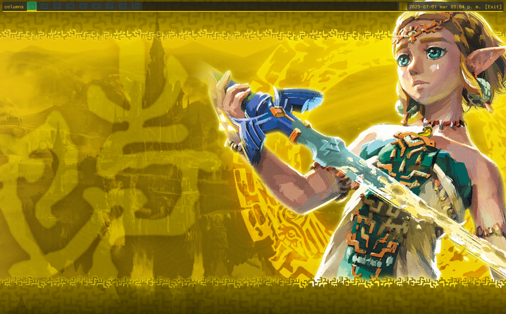
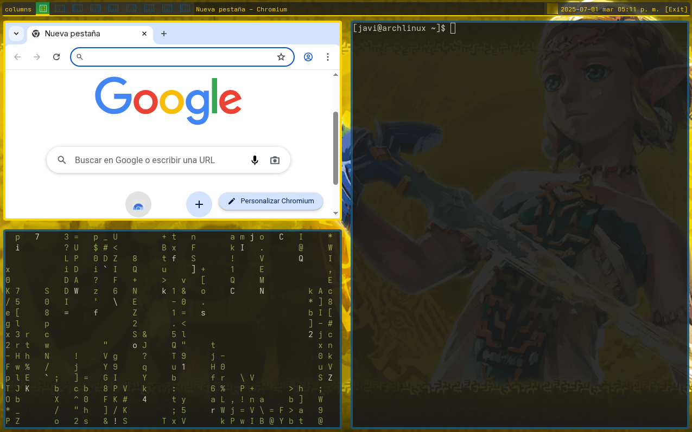

# Zelda Qtile Theme

A Legend of Zelda themed configuration for the Qtile window manager on Arch Linux.

### Clean Desktop View


### Theme Preview with Terminals


## Features

- **Zelda-inspired color scheme**: Gold, green, and blue colors reminiscent of the Legend of Zelda series
- **Rounded window borders**: Terminal windows with yellow borders and 4px radius corners
- **Translucent backgrounds**: Semi-transparent terminal (85% opacity) and panel backgrounds to showcase your wallpaper
- **Zelda-themed workspace icons**: Themed workspace labels with Zelda-related emojis
- **Enhanced UI elements**: Widgets with more opaque backgrounds and rounded corners for better visibility

## Requirements

- Arch Linux
- Qtile window manager
- Python 3
- Picom (for transparency effects, rounded corners, and shadows)
- Feh (for setting wallpaper)
- python-psutil (for CPU and memory widgets)
- yay (AUR helper)
- cmatrix (optional - for matrix effect)
- chromium (web browser)

## Installation

1. Clone this repository:
   ```bash
   git clone https://github.com/JaviMGG/zelda-qtile-theme.git
   cd zelda-qtile-theme
   ```

2. Run the installation script:
   ```bash
   chmod +x install.sh
   ./install.sh
   ```

3. Log out and log back in to apply the Qtile configuration, or restart Qtile with `Mod+Control+r`

## Troubleshooting

### Installation Issues

Error "externally-managed-environment": If you receive this error during installation, it's because Python is managed by the operating system. You can solve it in several ways:

1. Install dependencies through the system package manager:
   ```bash
   sudo pacman -S python-psutil  # For Arch Linux
   ```

2. Create a virtual environment for the installation:
   ```bash
   python -m venv venv
   source venv/bin/activate  # On Linux
   # or
   .\venv\Scripts\activate  # On Windows
   pip install psutil
   ```

3. Force installation with pip (not recommended but works in some cases):
   ```bash
   pip install --break-system-packages psutil
   ```

### Other Issues

- **Permissions**: Make sure the scripts have execution permissions:
  ```bash
  chmod +x install.sh
  chmod +x ~/.config/qtile/autostart.sh
  ```

- **Missing dependencies**: If some components don't work correctly, verify that all dependencies are installed:
  ```bash
  sudo pacman -S python-pip python-xcffib python-cairocffi python-cffi imagemagick feh picom
  ```

- **Wallpaper not visible**: If the wallpaper doesn't display correctly, verify that feh is installed and the wallpaper file exists:
  ```bash
  sudo pacman -S feh
  ls -la ~/.config/qtile/wallpaper.png
  feh --bg-fill ~/.config/qtile/wallpaper.png
  ```

- **Transparency not working**: If transparency effects don't work, make sure picom is installed and running:
  ```bash
  sudo pacman -S picom
  picom -b
  ```

- **Slow performance**: If you experience slowness when loading or using the theme:
  ```bash
  # Restart picom with the optimized configuration
  pkill picom
  picom --config ~/.config/qtile/picom.conf -b
  ```
  You can also edit the `~/.config/qtile/picom.conf` file to disable more visual effects or adjust the configuration to your needs.

## Manual Installation

If you prefer to install manually:

1. Back up your existing Qtile configuration:
   ```bash
   cp -r ~/.config/qtile ~/.config/qtile.backup
   ```

2. Copy the configuration files and wallpaper:
   ```bash
   cp -r config/* ~/.config/qtile/
   cp zelda.png ~/.config/qtile/wallpaper.png
   ```

3. Make the autostart script executable:
   ```bash
   chmod +x ~/.config/qtile/autostart.sh
   ```

4. Log out and log back in, or restart Qtile with `Mod+Control+r`

## Customization

### Changing the Wallpaper

Replace the `~/.config/qtile/wallpaper.png` file with your preferred Zelda-themed wallpaper.

### Modifying Colors and Opacity

Edit the color scheme in `~/.config/qtile/config.py` by modifying the `colors` dictionary.

Adjust the opacity of UI elements by modifying these variables in config.py:
```python
# Define colors with opacity
bar_bg = "#1A1A1ACC"  # Black with 80% opacity for the bar
widget_bg = "#2D2D2DDD"  # Dark gray with 87% opacity for widgets
```

You can also change the bar opacity directly:
```python
opacity=0.95,  # More opaque bar
```

### Workspace Icons

Customize the workspace icons by editing the `groups` list in `~/.config/qtile/config.py`.

### Terminal Transparency and Rounded Corners

The theme includes a custom picom configuration that provides:

- 90% opacity for terminal windows (Alacritty, Kitty, XTerm, etc.)
- 4px rounded corners for all windows
- Performance-optimized settings for faster loading

You can adjust these settings in picom.conf to your preference.

### Performance Optimization

The picom configuration has been optimized for better performance:

- Animations disabled to reduce CPU usage
- Shadows disabled to improve rendering speed
- Blur effects disabled for better performance
- Backend set to xrender instead of glx for lighter resource usage
- Fading transitions optimized for speed

If you experience slow loading or performance issues, these optimizations should help. If you prefer visual effects over performance, you can re-enable these features in picom.conf.

## Key Bindings

- `Mod+Enter`: Launch terminal
- `Mod+w`: Close window
- `Mod+r`: Run command prompt
- `Mod+Tab`: Cycle through layouts
- `Mod+[1-9]`: Switch to workspace
- `Mod+Shift+[1-9]`: Move window to workspace
- `Mod+h/j/k/l`: Navigate windows
- `Mod+Shift+h/j/k/l`: Move windows
- `Mod+Control+h/j/k/l`: Resize windows
- `Mod+Control+r`: Restart Qtile
- `Mod+Control+q`: Quit Qtile

## File Structure

```
.
├── config/
│   ├── config.py                       # Main Qtile configuration
│   ├── autostart.sh                    # Autostart script
│   └── picom.conf                      # Picom compositor configuration
├── screenshots/
│   └── zeldaWithTerminals.png          # Theme preview
│   └── zeldaWithoutTerminals.png       # Theme preview
├── zelda.png                           # Wallpaper image
├── install.sh                          # Installation script
├── requirements.txt                    # Python dependencies
└── README.md                           # This file
```

## License

MIT

## Credits

- The Legend of Zelda is a trademark of Nintendo
- Qtile window manager: https://qtile.org
